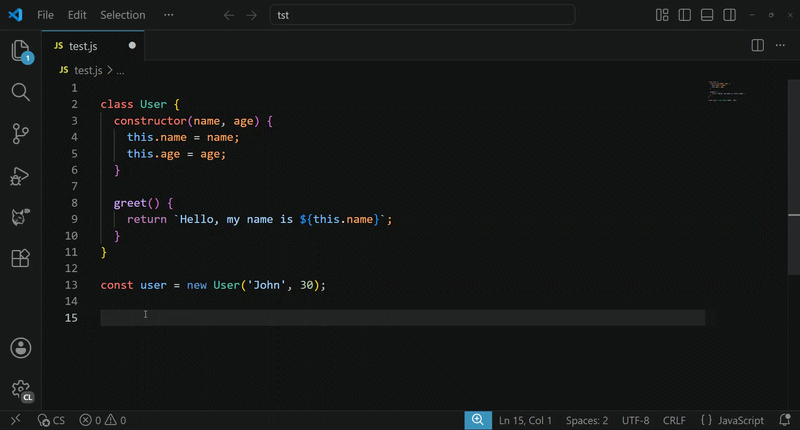
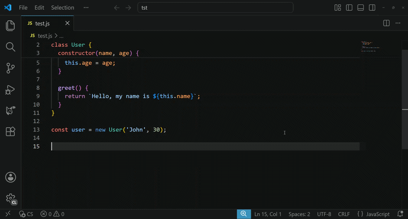
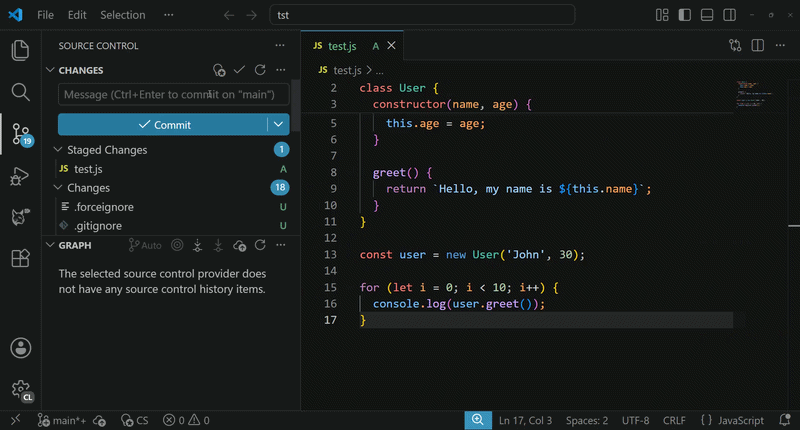

# CodeSprite

> AI ghost text for VS Code. Inline completions, AI commands, and commit messages — bring your own key, open-source.

> ⚠️ **CodeSprite is an early prototype**. Have an idea, found a bug, or want to contribute? Head over to [GitHub](https://github.com/mmilidoni/vscode-codesprite) and open an issue or PR. Feedback welcome.

CodeSprite is a lightweight VS Code extension that adds three AI coding features without locking you into a specific provider. Choose your preferred AI provider from the built-in presets or bring any OpenAI-compatible endpoint.

- **Inline completions** — ghost-text suggestions appear as you type, in any language.
- **AI Command modal** — trigger a natural-language instruction (`Ctrl+Shift+I`) and insert or replace code at the cursor.
- **Commit message generator** — one click in the Source Control panel turns your staged diff into a Conventional Commit message.

Built with TypeScript + esbuild. No runtime dependencies. MIT licensed.

## Features

### 1. Inline completions



Just type. After the configured debounce delay, CodeSprite requests a completion and renders it as ghost text. Press `Tab` to accept. Suggestions are de-duplicated against the code that already follows your cursor, so you never get duplicate lines.

If the status bar shows `$(warning) CS`, no API key is set. If it shows `$(error) CS`, the last request failed — hover for details.

### 2. AI Command modal



Press `Ctrl+Shift+I` (macOS: `Cmd+Shift+I`) with a text editor focused. Type a natural-language instruction, for example:

- `create a new variable called abc`
- `convert this loop to a list comprehension`
- `add a docstring`

- **No selection** — the generated code is inserted at the cursor.
- **With a selection** — the selected text is replaced with the generated code.

Inserted code is briefly highlighted so you can review it; the highlight clears on the next edit, cursor move, or after 5 seconds. Use `Ctrl+Z` to undo if it's not what you wanted.

### 3. Commit message generator



Open the Source Control panel (`Ctrl+Shift+G`). Click the sparkle/lightbulb icon in the SCM title bar. CodeSprite reads your staged changes (`git diff --cached`), falls back to unstaged changes if nothing is staged, and writes a Conventional Commit message into the SCM input box.

The commit message prompt extracts a user-story number from the branch name when it follows the `1234-description` pattern, prefixing the message with `[1234]`.

## Quick start

Requires VS Code `^1.80.0` and an API key for your chosen AI provider.

1. **Install** — search for **CodeSprite** in the Extensions view (`Ctrl+Shift+X`).
2. **Configure** — open Settings (`Ctrl+,`), search for `codesprite`, and set at least:
   ```jsonc
   {
      "codesprite.provider": "openai",   // or: anthropic, gemini, mistral, xai, custom
      "codesprite.apiKey": "sk-your-key-here",
      // apiBaseUrl and model are optional — the 'openai' preset defaults to
      // https://opencode.ai/zen/v1 with minimax-m2.7. Other presets use their own defaults.
    }
   ```
3. **Use it** — just type for inline completions, press `Ctrl+Shift+I` for the AI Command modal, or click the sparkle icon in the Source Control panel to generate a commit message.

Click the `CS` indicator in the status bar to toggle all features on/off at once.

### Status bar

A `CS` indicator in the bottom-left status bar reflects the current state:

| Indicator | Meaning |
|-----------|---------|
| `$(lightbulb-autofix) CS` | Enabled (tooltip lists active features) |
| `$(circle-slash) CS` | Globally disabled |
| `$(loading~spin) CS` | A request is in flight |
| `$(warning) CS` | No API key configured |
| `$(error) CS` | Last request failed (hover for the error) |

---

## Configuration

Open Settings (`Ctrl+,`) and search for `codesprite`, or edit your `settings.json` directly.

| Setting | Type | Default | Description |
|---------|------|---------|-------------|
| `codesprite.enabled` | boolean | `true` | Master switch for all AI features. Click the status bar item to toggle. |
| `codesprite.inlineEnabled` | boolean | `true` | Enable inline ghost-text completions while typing. |
| `codesprite.commandEnabled` | boolean | `true` | Enable the AI Command modal (`Ctrl+Shift+I`). |
| `codesprite.commitMessageEnabled` | boolean | `true` | Enable the commit message generator in Source Control. |
| `codesprite.commitMaxTokens` | number | `256` | Max tokens the model may generate for a commit message (`16`–`4096`). |
| `codesprite.commitMaxDiffLength` | number | `8000` | Max characters of the git diff sent to the model (`512`–`100000`). Larger diffs are truncated. |
| `codesprite.commitPrompt` | string | _see setting_ | Custom system prompt for commit message generation. The git diff is appended as the user message. Defaults to a conventional commits prompt with detailed formatting guidelines. |
| `codesprite.provider` | enum | `"openai"` | AI provider preset. Built-in: `openai`, `anthropic`, `gemini`, `mistral`, `xai`. Use `custom` for any OpenAI-compatible endpoint (OpenRouter, Together, Ollama, etc.). |
| `codesprite.apiKey` | string | `""` | **Required.** API key for your selected provider. Keep this secret. |
| `codesprite.apiBaseUrl` | string | `""` | Base URL for the API endpoint. Leave empty to use the provider's default (e.g. `https://api.openai.com/v1`). |
| `codesprite.model` | string | `""` | Model identifier (e.g. `gpt-4o`, `claude-3-5-sonnet-20241022`). Leave empty to use the provider's recommended default. |
| `codesprite.streamEarlyStop` | boolean | `true` | Stop reading the SSE stream as soon as completion is signaled, reducing tail latency. |
| `codesprite.inlineDebounceDelay` | number | `1000` | Milliseconds to wait after typing stops before requesting an inline completion (`50`–`2000`). Lower = more responsive, higher API usage. Inline only. |
| `codesprite.inlineEnabledLanguages` | string[] | `["*"]` | Language IDs where inline autocomplete is active. Use `["*"]` for all, or list specific IDs like `["python", "typescript"]`. |
| `codesprite.commandEnabledLanguages` | string[] | `["*"]` | Language IDs where the AI Command modal is active. |

## Providers

CodeSprite ships with built-in presets for the major hosted AI providers. Set `codesprite.provider` to pick one. The extension automatically uses the correct API endpoint, authentication method, request format, and context window for each provider.

| Provider | Setting | Default model | Context window | Auth method |
|----------|---------|---------------|----------------|-------------|
| OpenAI | `openai` | `minimax-m2.7` * | 128 000 | `Authorization: Bearer` |
| Anthropic | `anthropic` | `claude-3-5-sonnet-20241022` | 200 000 | `x-api-key` header |
| Google Gemini | `gemini` | `gemini-1.5-pro` | 2 000 000 | `?key=` query param |
| Mistral | `mistral` | `codestral-latest` | 32 000 | `Authorization: Bearer` |
| xAI (Grok) | `xai` | `grok-2-mini` | 131 072 | `Authorization: Bearer` |
| Custom (OpenAI-compat) | `custom` | `gpt-4o-mini` | 128 000 | `Authorization: Bearer` |

**Leave `apiBaseUrl` and `model` empty** to use the provider defaults. Override them to point at a different endpoint or model.

> \* The `openai` preset defaults to `https://opencode.ai/zen/v1` (the opencode.ai BYOK service) with model `minimax-m2.7`. To use literal OpenAI, set `apiBaseUrl` to `https://api.openai.com/v1` and `model` to `gpt-4o` or `gpt-4o-mini`.

### Custom provider

Use `"codesprite.provider": "custom"` for any OpenAI-compatible endpoint — OpenRouter, Together, Groq, Ollama, LM Studio, OpenCode, or self-hosted. The `custom` preset uses the standard OpenAI chat completions format (`/chat/completions`, Bearer auth, SSE streaming). Just set `apiBaseUrl` and `model` to match your endpoint.

### Example: Gemini setup

```jsonc
{
  "codesprite.provider": "gemini",
  "codesprite.apiKey": "AIza..."
  // apiBaseUrl and model are optional — defaults are used
}
```

> **Note:** Gemini sends the API key as a URL query parameter (`?key=...`), not as an HTTP header. If you're behind a proxy that logs query strings, consider using a VPN or a different provider.

### Example: Anthropic setup

```jsonc
{
  "codesprite.provider": "anthropic",
  "codesprite.apiKey": "sk-ant-..."
  // system prompt is sent as a top-level field, not in the messages array
}
```

### Example: Ollama (local)

```jsonc
{
  "codesprite.provider": "custom",
  "codesprite.apiBaseUrl": "http://localhost:11434/v1",
  "codesprite.apiKey": "ollama",  // Ollama ignores the key but requires a non-empty value
  "codesprite.model": "codellama:7b"
}
```

## Installation

### From a `.vsix` package

```bash
code --install-extension codesprite-0.1.0.vsix
```

### From source

```bash
git clone https://github.com/mmilidoni/vscode-codesprite.git
cd vscode-codesprite
npm install
npm run package      # produces a .vsix in the project root
code --install-extension *.vsix
```

## Build from source

```bash
npm install
npx tsc --noEmit        # type-check (esbuild does NOT run tsc)
npm run build           # bundle to dist/extension.js with sourcemaps
npm run watch           # rebuild on change
npm run vscode:prepublish   # production minified bundle
npm run package         # production bundle + .vsix
```

**Type-check first, build second.** A clean build does not guarantee type safety — esbuild strips types without checking them. Always run `npx tsc --noEmit` before committing.

Press `F5` in VS Code to launch the extension host (runs the default build task, then opens a new window with CodeSprite loaded).

## Architecture

Single entrypoint: `src/extension.ts` → `activate()` wires up the three features. Each feature owns its own abort controller and shares a single status bar item.

| Module | Role |
|--------|------|
| `api.ts` | All HTTP calls. `_fetchAiCompletion()` is the single shared pipeline; dispatches on provider protocol for URL, headers, body, SSE, and JSON parsing. |
| `config.ts` | Reads VS Code settings, feature toggles, language filtering. |
| `providers.ts` | Provider preset catalog — default URLs, models, context windows, and protocol identifiers for each provider. |
| `context.ts` | Extracts prefix/suffix around the cursor with token-budget trimming. |
| `tokens.ts` | Char-based token estimation (~4 chars/token) and budget clamping. |
| `debounce.ts` | Cancellable delay for inline typing debounce. |
| `types.ts` | Shared interfaces for requests, responses, and config. |
| `errors.ts` | `getErrorMessage()` — canonical error normalization. |
| `statusBar.ts` | `resetStatusBarToReady()` — canonical status bar reset. |
| `provider.ts` | Inline completion provider (typing trigger). |
| `commandHandler.ts` | AI Command modal (`Ctrl+Shift+I`). |
| `commitMessage.ts` | Commit message generator (SCM title bar trigger). |

All HTTP traffic flows through one streaming pipeline that auto-detects SSE vs. JSON responses, supports early stream termination, and handles servers that omit `Content-Type`. See [`AGENTS.md`](./AGENTS.md) for the full contributor guide and gotchas.

## Privacy

CodeSprite sends the code around your cursor (prefix + suffix, trimmed to your configured token budget) and your natural-language instructions to the API endpoint you configure. No telemetry is collected by the extension itself. Review your provider's data policy before use.

## License

[MIT](./LICENSE) © mmilidoni
